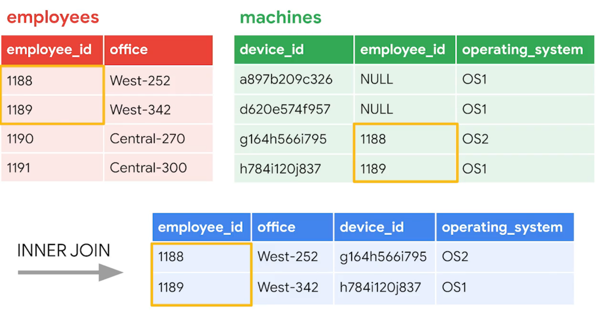

# Database Fundamentals and SQL Concepts

---

**A database is a structured collection of information that a computer can store, organize, and retrieve efficiently.**

A database groups data into structured formats—most commonly tables—so information can be searched, updated, and analyzed quickly.

It uses a Database Management System (DBMS) to handle tasks like storing data, enforcing rules, controlling access, and processing queries.

Because the data is structured, users can run precise queries to find exactly what they need without scanning through entire files or documents.

---

# Relational Database

A relational database is a structured database containing tables that are related to each other.

Each table represents one type of data (such as users, orders, or devices).

Rows contain individual records, and columns store specific fields for each record.

Tables can be linked using keys—usually a **primary key** in one table and a **foreign key** in another.

Because of these relationships, data stays consistent, avoids duplication, and can be queried efficiently using SQL.

---

# **Keys**

Keys are special fields in a relational database used to identify records and create relationships between tables.

---

**Primary Key (PK)**

A primary key uniquely identifies each row in a table.

It cannot be duplicated and cannot be empty.

*Example:*

`user_id` in a User's table.

---

**Foreign Key (FK)**

A foreign key is a field in one table that refers to the primary key in another table.

It creates a relationship between the two tables.

*Example:*

`user_id` in an Orders table linking back to the Users table.

---

# Query Databases with SQL

**Definition**

Querying a database means using SQL commands to retrieve, filter, update, insert, or delete data stored in tables.

**What SQL Does**

SQL (Structured Query Language) is the standard language used to communicate with relational databases.

It lets you ask the database for specific information, modify data, and manage structures like tables.

instruct the database:

- “SELECT” when you want to fetch
• “INSERT” when you want to add
• “UPDATE” to change
• “DELETE” to remove

## **Basic SQL query**

There are two essential keywords in any SQL query: **SELECT** and **FROM**. You will use these keywords every time you want to query a SQL database. Using them together helps SQL identify what data you need from a database and the table you are returning it from.

using symbols in sql 

  

1. In SQL, the asterisk `*` is the wildcard that means **“everything in this context.”** You’ll see it most often in a `SELECT` statement:

```sql
SELECT * FROM customers;
```

 

1.  The semicolon in SQL is a quiet little traffic signal. It tells the database engine, “That statement is complete. You may process it now.”

```sql
SELECT * FROM customers;
```

---

The **SELECT** keyword always comes with the **FROM** keyword. **FROM** indicates which table to query. To use the **FROM** keyword, you should write it after the **SELECT** keyword, often on a new line, and follow it with the name of the table you’re querying. If you want to return all columns from the **customers** table, you can write:

**SELECT ***

**FROM customers;**

When you want to end the query here, you put a semicolon (**;**) at the end to tell SQL that this is the entire query.

---

## **ORDER BY**

Database tables are often very complicated, and this is where other SQL keywords come in handy. **ORDER BY** is an important keyword for organizing the data you extract from a table.

**ORDER BY** sequences the records returned by a query based on a specified column or columns. This can be in either ascending or descending order.

**ORDER BY** sequences the records returned by a query based on a specified column or columns. This can be in either ascending or descending order.

### **SQL defaults to ascending order unless you tell it otherwise.**

You rarely see `ASC` written out because it’s already the default.

`DESC` is simply the flip switch. When you use it, you’re saying, “Sort in the opposite direction.”

```sql
-- Ascending order (default)
SELECT CustomerId, City, Country
FROM Customers
ORDER BY City;

-- Same thing, written explicitly
SELECT CustomerId, City, Country
FROM Customers
ORDER BY City ASC;

-- Descending order (reverse)
SELECT CustomerId, City, Country
FROM Customers
ORDER BY City DESC;

-- Numeric column example
SELECT CustomerId, City, Country
FROM Customers
ORDER BY CustomerId ASC;

SELECT CustomerId, City, Country
FROM Customers
ORDER BY CustomerId DESC;

```

### **Sorting based on multiple columns**

You can also choose multiple columns to order by. For example, you might first choose the **country** and then the **city** column. SQL then sorts the output by **country**, and for rows with the same **country**, it sorts them based on **city**. You can run this to explore how SQL displays this:

```sql
SELECT customerid, city, country
FROM customers
ORDER BY country, city;
```

```sql
+------------+---------------------+----------------+
| CustomerId | City                | Country        |
+------------+---------------------+----------------+
|         56 | Buenos Aires        | Argentina      |
|         55 | Sidney              | Australia      |
|          7 | Vienne              | Austria        |
|          8 | Brussels            | Belgium        |
|         13 | Brasília            | Brazil         |
|         12 | Rio de Janeiro      | Brazil         |
|          1 | São José dos Campos | Brazil         |
|         10 | São Paulo           | Brazil         |
|         11 | São Paulo           | Brazil         |
|         14 | Edmonton            | Canada         |
|         31 | Halifax             | Canada         |
|          3 | Montréal            | Canada         |
|         30 | Ottawa              | Canada         |
|         29 | Toronto             | Canada         |
|         15 | Vancouver           | Canada         |
|         32 | Winnipeg            | Canada         |
|         33 | Yellowknife         | Canada         |
|         57 | Santiago            | Chile          |
|          5 | Prague              | Czech Republic |
|          6 | Prague              | Czech Republic |
|          9 | Copenhagen          | Denmark        |
|         44 | Helsinki            | Finland        |
|         42 | Bordeaux            | France         |
|         43 | Dijon               | France         |
|         41 | Lyon                | France         |
+------------+---------------------+----------------+
```

---

# Filtering

# Filtering with `WHERE` and `LIKE` is how you nudge the database into doing pattern-matching instead of strict comparisons. Think of `LIKE` as a tiny magnifying glass that lets you search for *shapes* in text.

 1.  **where**

`WHERE` is the filter gate in SQL. It tells the database, “Only give me the rows that meet this condition.”

Without `WHERE`, you get everything.

With `WHERE`, you get only the rows that match.

Here’s what it looks like in pure code:

```sql
SELECT *
FROM machines
WHERE status = 'active';
```

That returns only the machines whose `status` column has the value `active`.

# 2. like

Think of `LIKE` as a tiny magnifying glass that lets you search for *shapes* in text.

Here’s the compact version in code form so you can see the mechanics clearly:

```
SELECT *
FROM machines
WHERE device_name LIKE 'A%';

```

This returns every row where `device_name` **starts with A**.

`%` means “any number of characters.”

Another flavor:

```
WHERE device_name LIKE '%server'

```

That finds anything that **ends with “server.”**

One more:

```
WHERE device_name LIKE '%lab%'

```

That grabs anything that **contains** “lab” anywhere inside it.

`_` is the single-character wildcard:

```
WHERE serial_number LIKE 'A_5';

```

That matches things like `AB5` or `A25`, because `_` stands for exactly one character.

---

## **Comparison operators**

In SQL, filtering numeric and date and time data often involves operators. You can use the following operators in your filters to make sure you return only the rows you need:

| **operator** | **use** |
| --- | --- |
| **<** | less than |
| **>** | greater than |
| **=** | equal to |
| **<=** | less than or equal to |
| **>=** | greater than or equal to |
| **<>** | not equal to |

---

# **Filters with AND, OR, and NOT**

## AND

The AND operator tells SQL that *both* conditions must be true at the same time. Think of it like a security rule that only triggers when two factors overlap.

**Example you were given:**

Find machines that run **OS 1** *and* use **Email Client 1**.

**SQL:**

```sql
SELECT *
FROM machines
WHERE operating_system = 'OS 1'
  AND email_client = 'Email Client 1';

```

**Meaning:**

This returns only machines sitting in the intersection of your two “circles”: OS 1 users who also use Email Client 1. If a machine satisfies only one of those conditions, it doesn’t make the cut.

## OR

The OR operator lets SQL return rows that meet *either* condition. One condition true is enough. Both true is also fine.

**Example you were given:**

Find machines that run **OS 1** *or* **OS 3** because both need a patch.

**SQL:**

```sql
SELECT *
FROM machines
WHERE operating_system = 'OS 1'
   OR operating_system = 'OS 3';

```

**Meaning:**

Any machine running OS 1 qualifies. Any machine running OS 3 qualifies. Machines running something else do not. In a Venn diagram, this is the entire area of both circles combined.

## NOT

The NOT operator reverses a condition. It’s SQL’s way of saying, “give me everything *except* this.”

**Example you were given:**

Update all devices *except* those running **OS 3**.

**SQL:**

```sql
SELECT *
FROM machines
WHERE NOT operating_system = 'OS 3';

```

**Meaning:**

This returns every machine outside the OS 3 circle. If OS 3 is the one group you want to leave alone, this operator quickly filters them out so you can update the rest.

---

<aside>
💡

The `success` column in the `log_in_attempts` table contains values of `TRUE` or `FALSE` to indicate whether the login was successful. MySQL stores Boolean values as `1` for `TRUE`, and `0` for `FALSE`. This means that `TRUE` is represented as `1`, and `FALSE` represented as `0` in the `success` column.

</aside>

---

# **Join tables in SQL**

A join combines data from two tables when they share a related column. Each table usually holds part of the information, and a join lets you see the full picture.



**Why joins matter:**

If one table tracks machines and another tracks employees, joining them shows which employee uses which machine. Same idea with vulnerabilities, customers, invoices—any relationship.

**How SQL knows which column belongs to which table:**

When two tables have a column with the same name, you prefix it with the table name like this:

```
employees.employee_id
machines.employee_id

```

That “table.column” pattern removes any confusion.

**Primary key vs foreign key:**

A primary key is the unique identifier in a table.

A foreign key is that same identifier used in another table to point back to it.

You join on these matching values.

**INNER JOIN (the most common type):**

An inner join returns only the rows where the matching column appears in *both* tables.

Example:

```sql
SELECT employees.username,
       employees.office,
       machines.operating_system
FROM employees
INNER JOIN machines
    ON employees.employee_id = machines.employee_id;
```

This will show only the employees who *have* machines assigned. Machines without an employee (NULL foreign key) won’t appear.

---

# Types of Joins

A join connects two tables so you can see related data together. The type of join determines *which rows* appear in the result.

**INNER JOIN**

Shows only rows where both tables have a matching value.

If there’s no match, the row disappears.

Example idea:

Employees who *have* machines assigned.

**LEFT JOIN (Left Outer Join)**

Returns *all* rows from the left table, plus matching rows from the right table.

If the right table has no match, the right-side columns become NULL.

Example idea:

All employees, even ones with no assigned machine.


so here when we use light join 

# **RIGHT JOIN (Right Outer Join)**

Returns *all* rows from the right table, plus matching rows from the left table.

If the left table has no match, left-side columns become NULL.

Example idea:

All machines, including ones that belong to no employee.

(Not all SQL engines support RIGHT JOIN; SQLite doesn’t.)


# **FULL OUTER JOIN**

Returns *every* row from both tables.

Where a match exists, rows combine.

Where no match exists, missing values appear as NULL.

Example idea:

A complete combined view of employees and machines, even if they don't connect.

(Some engines require workarounds, since not all support it directly.)


